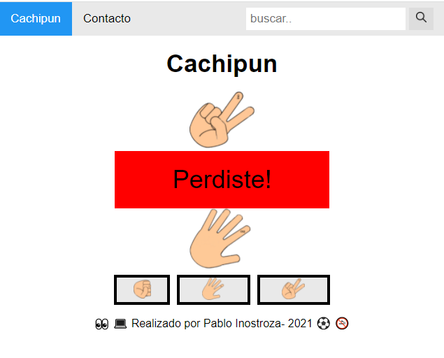
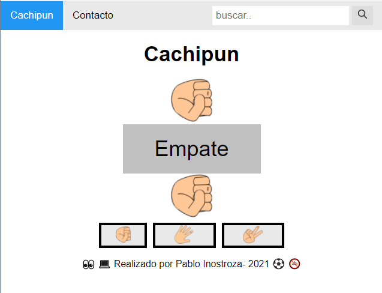
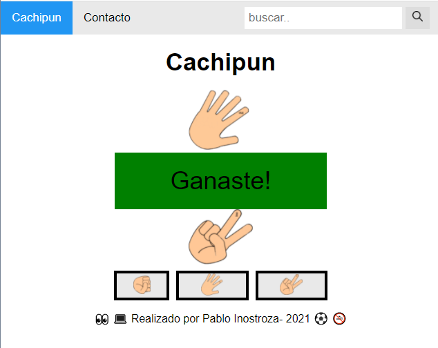
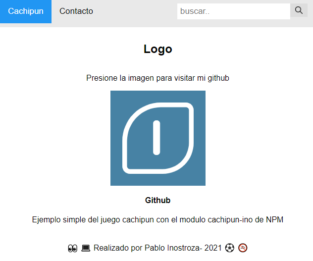

# node-cachipun
Juego cachipun (piedra, papel o tijera), desarrollado con nodeJs, express y ejs.

## Instalación
Para ejecutar este proyecto, ejecute localmente usando npm:

```
$ npm install
$ npm run dev
```


### Modulos
1-express <br>
2-cachipun-ino <br>
3-ejs<br>
4-morgan<br>






